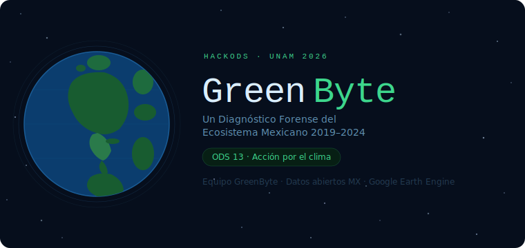
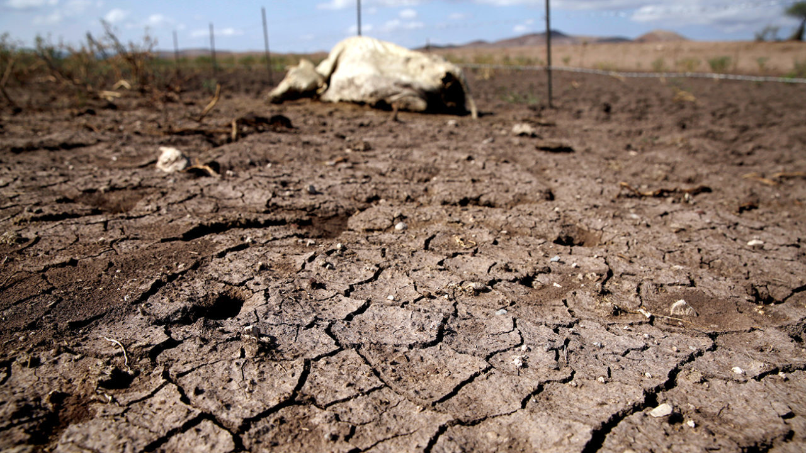
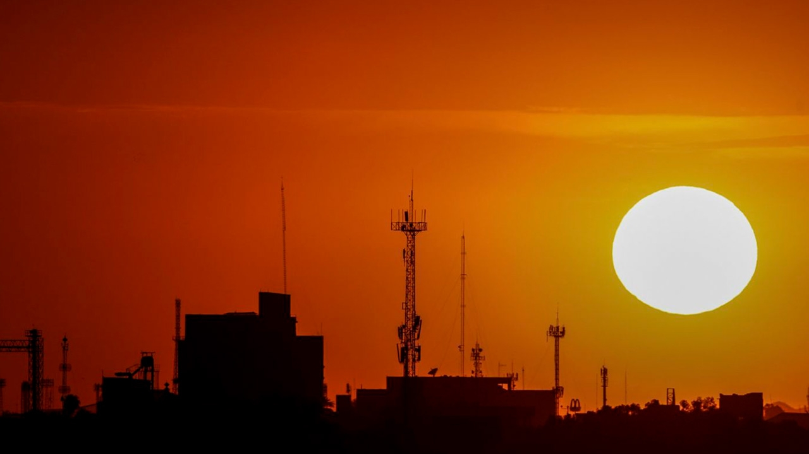
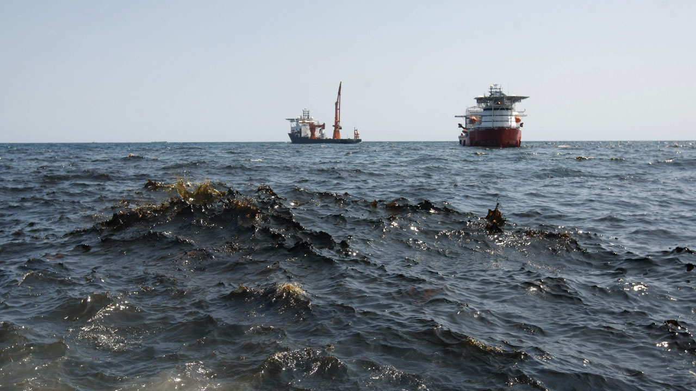
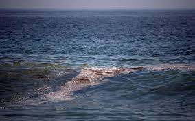

# Inicio {.unnumbered}

{width=100% fig-alt="Un Diagnóstico Forense del Ecosistema Mexicano 2019-2024"}

## Row {height="20%"}

### {width="50%"}
{fig-align="center"}

### {width="40%"} {height="20%"}

::: {.card .gb-hero-card}
::: {.gb-hero}

::: gb-eyebrow
MÓDULO DE INTELIGENCIA ECOSISTÉMICA V4.0
:::

::: gb-title
MÉXICO <span class="gb-accent">GREENBYTE</span>
:::

::: gb-sub
Un diagnóstico forense del territorio nacional. No partimos de una hipótesis, 
partimos de un interrogatorio estadístico a miles de datos satelitales 
para descubrir dónde y por qué se fractura la resiliencia climática de México.
:::

::: gb-pills
::: {.gb-pill .gb-p-green}
ODS 13: ACCIÓN CLIMÁTICA
:::
::: {.gb-pill .gb-p-blue}
DETECCIÓN AGNÓSTICA DE SESGOS
:::
::: {.gb-pill .gb-p-amber}
ANÁLISIS MULTIVARIADO
:::
:::

:::
:::

## {width="100%"}

### {width="40%"}

::: {.callout-tip icon=false appearance="simple" .ods-13-card}

🟢 ODS 13: Acción por el Clima

El **ODS 13** forma parte de la Agenda 2030 de la ONU para adoptar medidas urgentes contra el cambio climático y sus impactos. 

Busca integrar medidas climáticas en políticas nacionales, mejorar la educación sobre el cambio climático y movilizar fondos para mitigar emisiones y aumentar la resiliencia ante desastres naturales.

Lo que el **ODS 13** busca es adoptar medidas urgentes contra el cambio climático y sus impactos. Nuestra misión en **GreenByte** es dar un primer paso para **integrar el rigor científico en políticas nacionales**, aumentar la resiliencia y mitigar emisiones mediante evidencia reproducible, no solo promedios.

Este objetivo es crucial para México debido a su alta vulnerabilidad a eventos climáticos, afectando sectores como la agricultura, la seguridad hídrica y la biodiversidad.
:::


### Nuestra Perspectiva: El Rigor de la Pregunta Abierta

**¿Por qué GreenByte?** La mayoría de los proyectos climáticos nacen con una respuesta y buscan datos que la validen. Sin embargo, cuando se trata de tomar conciencia y accion por el clima, no podemos partir de una idea o hipotesis prefabricada, si no que debemos dejar que sean los mismos datos los que nos cuenten el malestar climatico del pais.

**La Motivación:** Nosotros hemos decidimos que para realmete tomar accion por el clima, antes debemos conocerlo, o bien, entender que personajes actuan en la historia. Por ello, el proposito de **GreenByte** es hacer un primer escaner del clima Mexicano, integrar y contar lo que el suelo de este país clama, pero muchas veces se ignora.

 Interrogamos al territorio como una escena del crimen ambiental. Cruzamos variables atmosféricas (NO₂), biológicas (NDVI) e hidrológicas (Precipitación) para entender no solo *si* el país cambia, sino *de qué forma* está fallando la respuesta natural ante el estrés.

Este proyecto tiene naturalmete limitaciones, principalmente relacionadas a la baja cantidad de datos encontrados para este fin, y la estrecha ventana de tiempo que se analizo, sin embargo, el realto que nos cuentan estos datos es suficiente para discernir a grandes razgos como se comporta el clima de Mexico.


## {width="100%"}

### {width="50%"}
{fig-align="center"}

### {width="50%"}
{fig-align="center"}


# Escena del Crimen {.unnumbered}

```{python}
#| include: false
import pandas as pd
import numpy as np
import plotly.graph_objects as go
from plotly.subplots import make_subplots

datos = pd.read_csv("resultados/escena_crimen.csv")

def norm(s):
    s = pd.to_numeric(s, errors='coerce')
    mn, mx = s.min(), s.max()
    return (s - mn) / (mx - mn)

datos['ndvi_n']   = norm(datos['ndvi'])
datos['evi_n']    = norm(datos['evi'])
datos['precip_n'] = norm(datos['precipitacion'])

sube = datos.dropna(subset=['anomalia_temp', 'sequia', 'muertes_calor']).copy()
sube['temp_n']    = norm(sube['anomalia_temp'])
sube['sequia_n']  = norm(sube['sequia'])
sube['muertes_n'] = norm(sube['muertes_calor'])

def tendencia(x, y):
    mask = ~np.isnan(np.array(y, dtype=float))
    x_ = np.array(x)[mask]
    y_ = np.array(y, dtype=float)[mask]
    m, b = np.polyfit(x_, y_, 1)
    return x_, m * x_ + b

def hex_rgba(hex_color, alpha=0.07):
    h = hex_color.lstrip('#')
    r, g, b = int(h[0:2], 16), int(h[2:4], 16), int(h[4:6], 16)
    return f'rgba({r},{g},{b},{alpha})'

anos_cae  = datos['year'].values
anos_sube = sube['year'].values

fig = make_subplots(
    rows=1, cols=2,
    subplot_titles=("", ""),
    horizontal_spacing=0.10
)

C_NDVI   = '#2d6a4f'
C_EVI    = '#52b788'
C_PRECIP = '#0077b6'
C_TEMP   = '#e63946'
C_SEQUIA = '#f77f00'
C_MUERTE = '#9b2226'

# ── Fondos por zonas ──────────────────────────────────────────────
for col in [1, 2]:
    fig.add_hrect(y0=0.5, y1=1.18,
                  fillcolor='#2d6a4f' if col == 1 else '#e63946',
                  opacity=0.04, line_width=0, row=1, col=col)
    fig.add_hrect(y0=-0.09, y1=0.5,
                  fillcolor='#e63946' if col == 1 else '#2d6a4f',
                  opacity=0.04, line_width=0, row=1, col=col)
    fig.add_hline(y=0.5, line_dash='dot', line_color='grey',
                  line_width=0.8, opacity=0.5, row=1, col=col)

# ── Panel izquierdo: LO QUE CAE ──────────────────────────────────
series_cae = [
    ('NDVI  \u2193  p=0.012 \u2713',              datos['ndvi_n'],   C_NDVI,   'circle'),
    ('EVI   \u2193  p=0.004 \u2713',              datos['evi_n'],    C_EVI,    'square'),
    ('Precipitaci\u00f3n \u2193  p=0.032 \u2713', datos['precip_n'], C_PRECIP, 'triangle-up'),
]

for label, vals, color, sym in series_cae:
    y = vals.values
    # Area rellena (sin fillcolor duplicado)
    fig.add_trace(go.Scatter(
        x=anos_cae, y=y,
        fill='tozeroy',
        fillcolor=hex_rgba(color, 0.07),
        mode='none',
        showlegend=False,
        hoverinfo='skip'
    ), row=1, col=1)
    # Tendencia
    xt, yt = tendencia(anos_cae, y)
    fig.add_trace(go.Scatter(
        x=xt, y=yt, mode='lines',
        line=dict(color=color, width=1.5, dash='dash'),
        showlegend=False, hoverinfo='skip'
    ), row=1, col=1)
    # Linea principal
    fig.add_trace(go.Scatter(
        x=anos_cae, y=y,
        mode='lines+markers',
        name=label,
        line=dict(color=color, width=2.2),
        marker=dict(symbol=sym, size=8, color=color,
                    line=dict(color='white', width=1.5)),
        hovertemplate='<b>%{x}</b>: %{y:.2f}<extra></extra>'
    ), row=1, col=1)

# Anotacion minimo NDVI
idx_min = int(datos['ndvi_n'].idxmin())
yr_min  = int(datos.loc[idx_min, 'year'])
vl_min  = float(datos.loc[idx_min, 'ndvi_n'])
fig.add_annotation(
    x=yr_min, y=vl_min + 0.04,
    text='M\u00ednimo<br>hist\u00f3rico<br>2022',
    showarrow=False, arrowhead=2, arrowcolor=C_NDVI,
    ax=40, ay=50,
    font=dict(size=10, color=C_NDVI),
    bgcolor='white', bordercolor=C_NDVI,
    borderwidth=1, borderpad=4, row=1, col=1
)

fig.add_annotation(
    x=2019, y=-0.07,
    text='3 de 3 variables significativas  p < 0.05',
    showarrow=False, xanchor='left',
    font=dict(size=9.5, color='#856404'),
    bgcolor='#fff3cd', bordercolor='#ffc107',
    borderwidth=1, borderpad=4, row=1, col=1
)

# ── Panel derecho: LO QUE SUBE ───────────────────────────────────
fig.add_trace(go.Bar(
    x=anos_sube, y=sube['muertes_n'].values,
    name='Muertes por calor \u2191  p=0.032 \u2713',
    marker_color=C_MUERTE, opacity=0.30,
    hovertemplate='<b>%{x}</b>: %{y:.2f}<extra></extra>'
), row=1, col=2)

xt, yt = tendencia(anos_sube, sube['muertes_n'].values)
fig.add_trace(go.Scatter(
    x=xt, y=yt, mode='lines',
    line=dict(color=C_MUERTE, width=1.5, dash='dash'),
    showlegend=False, hoverinfo='skip'
), row=1, col=2)

series_sube = [
    ('Anomal\u00eda temp. \u2191  p=0.001 \u2713', sube['temp_n'],   C_TEMP,   'circle'),
    ('Sequ\u00eda municipal \u2191 tendencia',      sube['sequia_n'], C_SEQUIA, 'cross'),
]

for label, vals, color, sym in series_sube:
    y = vals.values
    fig.add_trace(go.Scatter(
        x=anos_sube, y=y,
        fill='tozeroy',
        fillcolor=hex_rgba(color, 0.07),
        mode='none',
        showlegend=False,
        hoverinfo='skip'
    ), row=1, col=2)
    xt, yt = tendencia(anos_sube, y)
    fig.add_trace(go.Scatter(
        x=xt, y=yt, mode='lines',
        line=dict(color=color, width=1.5, dash='dash'),
        showlegend=False, hoverinfo='skip'
    ), row=1, col=2)
    fig.add_trace(go.Scatter(
        x=anos_sube, y=y,
        mode='lines+markers',
        name=label,
        line=dict(color=color, width=2.2),
        marker=dict(symbol=sym, size=9, color=color,
                    line=dict(color='white', width=1.5)),
        hovertemplate='<b>%{x}</b>: %{y:.2f}<extra></extra>'
    ), row=1, col=2)

fig.add_vline(x=2023, line_dash='dash', line_color=C_MUERTE,
              line_width=1.2, opacity=0.5, row=1, col=2)

fig.add_annotation(
    x=2023,           # <--- Cambia 2021 por 2023 (donde está el pico)
    y=1.0,            # <--- Sube a 1.0 (el máximo de tu escala normalizada)
    text='2023: pico cr\u00edtico<br>+380% muertes<br>sequ\u00eda m\u00e1xima',
    showarrow=True, 
    arrowhead=2, 
    arrowcolor=C_MUERTE,
    ax=-40,           # <--- Cambia a -40 para mover el texto a la izquierda
    ay=-50,           # <--- Cambia a -50 (negativo) para que el texto flote ARRIBA de la flecha
    font=dict(size=10, color=C_MUERTE),
    bgcolor='white', 
    bordercolor=C_MUERTE,
    borderwidth=1, 
    borderpad=4, 
    row=1, col=2
)

fig.add_annotation(
    x=2019, y=-0.07,
    text='Sequ\u00eda: 2003\u20132024  |  Temp & Muertes: 2015\u20132023',
    showarrow=False, xanchor='left',
    font=dict(size=9.5, color='#856404'),
    bgcolor='#fff3cd', bordercolor='#ffc107',
    borderwidth=1, borderpad=4, row=1, col=2
)

# ── Layout global corregido ─────────────────────────────────────────
# ── Layout global CORREGIDO Y SEPARADO ──────────────────────────────
fig.update_layout(
    title=dict(
        text=(
            '<b>Crisis climática en México 2015–2024</b><br>'
            '<span style="font-size:13px;color:#555">Deterioro del ecosistema y sus consecuencias humanas</span>'
        ),
        x=0.5, xanchor='center', y=0.97, 
        font=dict(size=17)
    ),
    height=650, # Un poco más de altura para que no se vea apretado
    plot_bgcolor='white',
    paper_bgcolor='rgba(0,0,0,0)',
    hovermode='x unified',
    
    # LEYENDA SEPARADA: Usamos x=0 y entrywidth para forzar la separación
    legend=dict(
        orientation='h',
        yanchor='bottom', 
        y=1.02,           # Sube la leyenda sobre los subplots
        xanchor='left', 
        x=0.0,            # Alinea al borde izquierdo
        font=dict(size=9, color='#444'),
        bgcolor='rgba(255,255,255,0.7)',
        # Forzamos a que cada etiqueta ocupe espacio para que las 
        # de la derecha se muevan hacia allá automáticamente
        entrywidth=0.32, 
        entrywidthmode='fraction'
    ),
    
    # Aumentamos margen superior (t) para que quepa Título + Leyenda + Subtítulos
    margin=dict(t=170, b=80, l=60, r=40), 
)

# ── Títulos de subplots alineados con sus gráficas ──────────────────
# Primer título (Izquierda)
fig.layout.annotations[0].update(
    text='<b style="color:#2d6a4f">Lo que está CAYENDO</b><br><span style="font-size:11px;color:#2d6a4f">vegetación y disponibilidad de agua</span>',
    y=0.92,       # Bajamos un poco para que no choque con la leyenda
    x=0.22,       # Centrado sobre el primer gráfico
    xanchor='center',
    yref='paper', xref='paper'
)

# Segundo título (Derecha)
fig.layout.annotations[1].update(
    text='<b style="color:#e63946">Lo que está SUBIENDO</b><br><span style="font-size:11px;color:#e63946">temperatura, sequía y muertes por calor</span>',
    y=0.92,       # Misma altura que el anterior
    x=0.78,       # Centrado sobre el segundo gráfico
    xanchor='center',
    yref='paper', xref='paper'
)

# Ajuste de los títulos de los subplots centrados sobre cada columna
fig.layout.annotations[0].update(
    text='<b style="color:#2d6a4f">Lo que está CAYENDO</b><br><span style="font-size:11px;color:#2d6a4f">vegetación y disponibilidad de agua</span>',
    y=0.95, 
    x=0.22,      
    xanchor='center',
    yref='paper',
    xref='paper'
)

fig.layout.annotations[1].update(
    text='<b style="color:#e63946">Lo que está SUBIENDO</b><br><span style="font-size:11px;color:#e63946">temperatura, sequía y muertes por calor</span>',
    y=0.95, 
    x=0.78,      
    xanchor='center',
    yref='paper',
    xref='paper'
)

for col in [1, 2]:
    fig.update_xaxes(
        tickvals=list(anos_cae if col == 1 else anos_sube),
        ticktext=[str(int(y)) for y in (anos_cae if col == 1 else anos_sube)],
        tickangle=-45, tickfont=dict(size=9),
        gridcolor='#eaecef', linecolor='#d0d5dc',
        showline=True, zeroline=False,
        title_text='A\u00f1o', title_font=dict(size=10, color='#555'),
        row=1, col=col
    )

fig.update_yaxes(
    title_text='Escala normalizada (0 = peor, 1 = mejor)',
    title_font=dict(size=10, color='#555'),
    range=[-0.09, 1.18], tickformat='.1f',
    gridcolor='#eaecef', linecolor='#d0d5dc',
    showline=True, zeroline=False, tickfont=dict(size=9),
    row=1, col=1
)
fig.update_yaxes(
    title_text='Escala normalizada (0 = mejor, 1 = peor)',
    title_font=dict(size=10, color='#555'),
    range=[-0.09, 1.18], tickformat='.1f',
    gridcolor='#eaecef', linecolor='#d0d5dc',
    showline=True, zeroline=False, tickfont=dict(size=9),
    row=1, col=2
)
```

## Row {width="70%"}

{.img-evidencia width="100%"}

## 
::: {.expediente-sello}
`EXPEDIENTE` · ODS-13 · MÉXICO · 2015–2024 · EVIDENCIA CLIMÁTICA
:::

## Row {width="90%"}

Los primeros indicios llegaron desde el espacio. Los satélites de la NASA —ciegos a las fronteras políticas, sordos a los comunicados oficiales— registraron algo perturbador: **la vegetación de México lleva una década retrocediendo.** Los índices NDVI y EVI, que miden cuánto verde cubre el territorio, muestran una caída estadísticamente significativa. No es ruido. No es un año malo. Es una tendencia.

La precipitación cuenta el mismo cuento con distintas palabras: **menos agua cayendo, menos suelo húmedo, menos vida sostenible.**

Mientras tanto, desde el otro extremo del expediente, llegan los registros que mantienen despiertas a las autoridades sanitarias. La temperatura sube. La sequía se extiende municipio a municipio. Y las muertes por golpe de calor —esas que aparecen en estadísticas discretas, sin grandes titulares— **se dispararon un 380% en el pico de 2023.**

Seis variables. Dos direcciones opuestas. Una sola conclusión: **aquí ocurrió algo.**

## Row {height="550px"}

```{python}
#| fig-cap: "Variables normalizadas al rango [0,1] para comparar magnitudes distintas. Las líneas punteadas son la tendencia lineal (Sen's slope). Pasa el cursor sobre los puntos para ver valores exactos."
fig.show()
```

## Row {height="250px"}

En el panel izquierdo, el heatmap no es una gráfica — es el historial clínico
de un territorio en deterioro. Treinta y dos estados, con Sonora, Baja California
y Sinaloa encabezando la lista: cicatrices de sequía extrema que no se cierran,
que se acumulan año tras año desde 2015. Lo que hay a la derecha de esa línea
no es una anomalía. Es una tendencia. El promedio nacional de 2024 — 1.54 en
la escala de severidad — no es un dato; es una advertencia.

En el panel derecho, el fuego revela su geografía. No es aleatorio: entre los
17° y 19°N — Michoacán, Guerrero, Oaxaca — la actividad de incendios se
concentra con una regularidad que 2019 llevó a su punto más alto. El fuego
no elige el bosque por azar. Sigue al estrés hídrico como su consecuencia
más visible.

Juntos, los dos paneles confirman lo mismo desde ángulos distintos: el
deterioro del ecosistema mexicano tiene patrón geográfico, tiene dirección
temporal, y tiene nombre — **sequía acumulada**.

> **Fuentes:** Monitor de Sequía en México, SMN-CONAGUA (2003–2024) ·
> NASA FIRMS VIIRS-SNPP vía Google Earth Engine (2015–2024)


## Row {height="600px"}

### Sequía por estado {width="50%"}

```{python}
#| fig-cap: "Nivel de sequía por estado 2003–2024. Ordenado por mayor afectación histórica."
#| warning: false
import pandas as pd
import numpy as np
import matplotlib.pyplot as plt

df_sequia = pd.read_csv("resultados/sequia_estados.csv", encoding='utf-8-sig')

pivot_sequia = (df_sequia[df_sequia['year'].between(2003, 2024)]
                .groupby(['estado', 'year'])['nivel']
                .mean().unstack(fill_value=0))
orden = pivot_sequia.mean(axis=1).sort_values(ascending=False).index
pivot_sequia = pivot_sequia.loc[orden]
años_seq = list(pivot_sequia.columns)

fig1, ax1 = plt.subplots(figsize=(8, 7))
im1 = ax1.imshow(pivot_sequia.values, aspect='auto',
                 cmap='YlOrRd', vmin=0, vmax=3, interpolation='nearest')

_ = ax1.set_xticks(range(len(años_seq)))
_ = ax1.set_xticklabels(años_seq, rotation=45, ha='right', fontsize=8.5)
_ = ax1.set_yticks(range(len(pivot_sequia.index)))
_ = ax1.set_yticklabels(pivot_sequia.index, fontsize=8.5)

if 2015 in años_seq:
    idx_2015 = años_seq.index(2015)
    ax1.axvline(idx_2015 - 0.5, color='white', linewidth=2.5, linestyle='--', alpha=0.8)
    _ = ax1.text(idx_2015 - 0.7, len(pivot_sequia.index) - 1,
                 'inicio\nsatelital', ha='right', fontsize=8,
                 color='white', fontweight='bold')

for i, estado in enumerate(pivot_sequia.index):
    for j, año in enumerate(años_seq):
        val = pivot_sequia.loc[estado, año]
        if val >= 2.5:
            _ = ax1.text(j, i, f'{val:.1f}', ha='center', va='center',
                         fontsize=6.5, color='white', fontweight='bold')

cbar1 = fig1.colorbar(im1, ax=ax1, fraction=0.025, pad=0.01)
cbar1.set_ticks([0, 1, 2, 3])
_ = cbar1.set_ticklabels(['Sin sequía', 'Moderada', 'Severa', 'Extrema'])
cbar1.ax.tick_params(labelsize=8)
_ = ax1.set_title('Severidad de sequía por estado · México 2003–2024\n'
                  'Ordenado por mayor afectación histórica — más rojo = más severo',
                  fontsize=11, fontweight='bold', color='#c1440e', pad=10)

plt.tight_layout()
plt.show()
```

### Fuegos por latitud {width="50%"}

```{python}
#| fig-cap: "Distribución de fuegos activos por banda latitudinal 2015–2024."
#| warning: false
df_fires = pd.read_csv("resultados/fuegos_latitud.csv", encoding='utf-8-sig')

pivot_fire = (df_fires.groupby(['year', 'lat_label'])['fire_count']
              .sum().unstack(fill_value=0))
años_fire     = list(pivot_fire.index)
total_fire_yr = pivot_fire.sum(axis=1).values
lat_labels    = list(pivot_fire.columns)

fig2, ax2 = plt.subplots(figsize=(8, 7))
im2 = ax2.imshow(pivot_fire.T.values, aspect='auto',
                 cmap='YlOrRd', interpolation='nearest')

_ = ax2.set_xticks(range(len(años_fire)))
_ = ax2.set_xticklabels(años_fire, rotation=45, ha='right', fontsize=8.5)
_ = ax2.set_yticks(range(len(lat_labels)))
_ = ax2.set_yticklabels(lat_labels, fontsize=8.5)

idx_max_fire = int(np.argmax(total_fire_yr))
ax2.axvline(idx_max_fire, color='white', linewidth=2, linestyle='-', alpha=0.5)
_ = ax2.text(idx_max_fire, -0.8, f'pico\n{años_fire[idx_max_fire]}',
             ha='center', fontsize=8, color='white', fontweight='bold')

cbar2 = fig2.colorbar(im2, ax=ax2, fraction=0.04, pad=0.01)
_ = cbar2.set_label('Fuegos activos', fontsize=8)
cbar2.ax.tick_params(labelsize=8)
_ = ax2.set_title('Distribución de fuegos por latitud · México 2015–2024\n'
                  'Más rojo = más fuegos activos registrados ese año',
                  fontsize=11, fontweight='bold', color='#c1440e', pad=10)
_ = ax2.set_ylabel('Banda latitudinal', fontsize=9)

plt.tight_layout()
plt.show()
```

## Row {height="200px"}

### Tendencia nacional de sequía {width="50%"}

```{python}
#| fig-cap: "Promedio nacional del nivel de sequía por año. Línea punteada = tendencia OLS."
#| warning: false
media_seq_yr = pivot_sequia.mean(axis=0).values

fig3, ax3 = plt.subplots(figsize=(8, 2))

colores_s = ['#d62828' if v > np.median(media_seq_yr) else '#f4a261'
             for v in media_seq_yr]
ax3.bar(range(len(años_seq)), media_seq_yr, color=colores_s,
        edgecolor='white', linewidth=0.4)

m, b = np.polyfit(range(len(años_seq)), media_seq_yr, 1)
ax3.plot(range(len(años_seq)), m * np.arange(len(años_seq)) + b,
         '--', color='#9b2226', linewidth=2)

idx_max_s = int(np.argmax(media_seq_yr))
_ = ax3.annotate(f'máx.\n{media_seq_yr[idx_max_s]:.2f}',
             xy=(idx_max_s, media_seq_yr[idx_max_s]),
             xytext=(idx_max_s - 2, media_seq_yr[idx_max_s] + 0.05),
             fontsize=9, color='#9b2226', fontweight='bold',
             arrowprops=dict(arrowstyle='->', color='#9b2226', lw=1.2))

_ = ax3.set_xticks(range(len(años_seq)))
_ = ax3.set_xticklabels(años_seq, rotation=45, ha='right', fontsize=8)
_ = ax3.set_ylabel('Nivel promedio', fontsize=9)
_ = ax3.set_title('Promedio nacional de sequía — la tendencia al alza es clara',
                  fontsize=11, fontweight='bold', color='#c1440e')
if 2015 in años_seq:
    ax3.axvline(idx_2015 - 0.5, color='grey', linewidth=1.5, linestyle='--', alpha=0.5)
ax3.set_ylim(0, media_seq_yr.max() * 1.4)

plt.tight_layout()
plt.show()
```

### Total nacional de fuegos {width="50%"}

```{python}
#| fig-cap: "Total de fuegos activos por año a nivel nacional. Tendencia creciente ↑ p=0.032 ✓"
#| warning: false
fig4, ax4 = plt.subplots(figsize=(8, 2))

colores_f = ['#d62828' if v > np.median(total_fire_yr) else '#f4a261'
             for v in total_fire_yr]
ax4.bar(range(len(años_fire)), total_fire_yr,
        color=colores_f, edgecolor='white', linewidth=0.4)

m2, b2 = np.polyfit(range(len(años_fire)), total_fire_yr, 1)
ax4.plot(range(len(años_fire)), m2 * np.arange(len(años_fire)) + b2,
         '--', color='#9b2226', linewidth=2)

_ = ax4.annotate(f'máx.\n{int(total_fire_yr[idx_max_fire]):,}',
             xy=(idx_max_fire, total_fire_yr[idx_max_fire]),
             xytext=(idx_max_fire - 2, total_fire_yr[idx_max_fire] * 1.05),
             fontsize=9, color='#9b2226', fontweight='bold',
             arrowprops=dict(arrowstyle='->', color='#9b2226', lw=1.2))

_ = ax4.set_xticks(range(len(años_fire)))
_ = ax4.set_xticklabels(años_fire, rotation=45, ha='right', fontsize=8)
_ = ax4.set_ylabel('Total fuegos', fontsize=9)
_ = ax4.set_title('Total nacional de fuegos — tendencia creciente ↑ p=0.032 ✓',
                  fontsize=11, fontweight='bold', color='#c1440e')
ax4.set_ylim(0, total_fire_yr.max() * 1.3)

plt.tight_layout()
plt.show()
```


## Row {width="90%"}

### {width="50%"}

{.img-evidencia width="100%"}

### {width="50%"}

El detective experimentado sabe que cuando seis fuentes independientes apuntan en la misma dirección, no es una coincidencia. Es un patrón. Y los patrones tienen causas. Al observar las líneas de tendencia —esas cicatrices punteadas que atraviesan las gráficas— la sospecha se vuelve certeza: **el sistema está bajo ataque.** Pero un peritaje no termina en el hallazgo del cuerpo; apenas comienza ahí. Ahora debemos diseccionar el daño para entender el alcance real de la agresión.


# Ruido Blanco

## Row {width="70%"}

{.img-evidencia width="100%"}

## Row {height="50px"}

Selecciona una variable y desliza el año para observar la evolución del estrés climático en México.


## Row {height="600px"}

```{ojs}
//| echo: false
//| code-fold: false

// 1. CARGA DE PLOTLY — con require, que es nativo de OJS
Plotly = require("https://cdn.plot.ly/plotly-2.24.1.min.js").catch(() => window.Plotly)

// 2. CARGA DE DATOS
data = FileAttachment("resultados/master_greenbyte_v4.csv").csv({ typed: true })

// 3. CONTROLES
viewof selectedVar = Inputs.select(
  new Map([
    ["🌡️ Fiebre (Anomalía T2m)", "t2m_anomaly"],
    ["💧 Sed (Anomalía Precipitación)", "precip_anomaly"],
    ["🌿 Vigor Vegetal (NDVI)", "NDVI"],
    ["🏭 Contaminación (NO2)", "NO2"]
  ]),
  { label: "Variable:", value: "t2m_anomaly" }
)

viewof selectedYear = Inputs.range(
  [2015, 2024],
  { value: 2024, step: 1, label: "Año de Análisis:" }
)

// 4. FILTRADO
filtered = data.filter(d => +d.year === +selectedYear)

// 5. MAPA — todo en una sola celda, Plotly ya está resuelto arriba
{
  // Esperamos explícitamente a que Plotly esté listo
  const P = await Plotly;

  const div = document.createElement("div");
  div.style.cssText = `
    width: 100%; height: 700px;
    border-radius: 15px;
    background: #0f172a;
    border: 1px solid #1e293b;
    box-shadow: 0 4px 6px -1px rgb(0 0 0 / 0.1);
  `;
  yield div;

  if (!filtered || filtered.length === 0) return;

  const isAnomaly = selectedVar.includes("anomaly");

  const trace = {
    type: "scattergeo",
    lat: filtered.map(d => +d.latitude),
    lon: filtered.map(d => +d.longitude),
    mode: "markers",
    marker: {
      size: 4.5,
      color: filtered.map(d => +d[selectedVar]),
      colorscale: isAnomaly ? "RdBu" : "Viridis",
      reversescale: selectedVar === "t2m_anomaly",
      opacity: 0.9,
      colorbar: {
        title: { text: "Intensidad", font: { color: "#94a3b8", size: 12 } },
        tickfont: { color: "#94a3b8" },
        thickness: 18,
        len: 0.8
      }
    },
    hovertemplate: `<b>%{lat:.2f}N, %{lon:.2f}W</b><br>Valor: %{marker.color:.4f}<extra></extra>`
  };

  const layout = {
    geo: {
      scope: "north america",
      resolution: 50,
      showland: true,     landcolor: "#1e293b",
      showocean: true,    oceancolor: "#0f172a",
      showlakes: true,    lakecolor: "#0f172a",
      showcountries: true, countrycolor: "#475569",
      showcoastlines: true, coastlinecolor: "#475569",
      showframe: false,
      bgcolor: "rgba(0,0,0,0)",
      lonaxis: { range: [-118, -86] },
      lataxis: { range: [14, 33] },
      projection: { type: "mercator" }
    },
    margin: { r: 10, t: 40, b: 10, l: 10 },
    paper_bgcolor: "rgba(0,0,0,0)",
    plot_bgcolor:  "rgba(0,0,0,0)",
    font: { family: "Inter, sans-serif", color: "#f8fafc" },
    title: {
      text: `Análisis Geoespacial · ${selectedVar} · ${selectedYear}`,
      font: { color: "#22c55e", size: 16 },
      x: 0.05
    }
  };

  P.react(div, [trace], layout, { responsive: true, displayModeBar: false });
}
```


```{python}
#| echo: false
#| warning: false
#| message: false

import pandas as pd
import numpy as np
import plotly.graph_objects as go

df_anual   = pd.read_csv('resultados/df_anual.csv')
mk_df      = pd.read_csv('resultados/mk_results.csv')
mk_results = {row['variable']: row for _, row in mk_df.iterrows()}

LABELS = {
    'sst'                 : 'Temperatura Superficial del Mar (°C)',
    't2m_anomaly'         : 'Anomalía de Temperatura del Aire vs 1981–2010 (°C)',
    'LST_day'             : 'LST Diurna — Temperatura de Superficie (K)',
    'precipitation'       : 'Precipitación Total Anual (mm/año)',
    'precip_anomaly'      : 'Anomalía de Precipitación (mm)',
    'precip_extreme_days' : 'Días con Precipitación Extrema (> p95)',
    'ET'                  : 'Evapotranspiración Real (mm/año)',
    'NDVI'                : 'NDVI — Índice de Vegetación',
    'EVI'                 : 'EVI — Índice de Vegetación Mejorado',
    'NO2'                 : 'NO₂ atmosférico (mol/m²)',
    'CO'                  : 'CO atmosférico (mol/m²)',
    'SO2'                 : 'SO₂ atmosférico (mol/m²)',
    'loss_anual'          : 'Pérdida Forestal Anual (fracción del área)',
    'fire_count'          : 'Focos de Calor Activos (satélite)',
}

Y_LABELS = {
    'sst'                 : '°C',
    't2m_anomaly'         : '°C (anomalía)',
    'LST_day'             : 'Kelvin (K)',
    'precipitation'       : 'mm/año',
    'precip_anomaly'      : 'mm',
    'precip_extreme_days' : 'días/año',
    'ET'                  : 'mm/año',
    'NDVI'                : 'índice (0–1)',
    'EVI'                 : 'índice (0–1)',
    'NO2'                 : 'mol/m²',
    'CO'                  : 'mol/m²',
    'SO2'                 : 'mol/m²',
    'loss_anual'          : 'fracción del área',
    'fire_count'          : 'focos detectados',
}

COLOR_UP   = '#c0392b'
COLOR_DOWN = '#1a8a4a'
COLOR_NONE = '#7f8c8d'
COLOR_LINE = '#1a5276'
COLOR_FILL = 'rgba(26, 82, 118, 0.07)'

def make_figure(var):
    serie = df_anual[['year', var]].dropna()
    if len(serie) < 2:
        return None

    years  = serie['year'].values
    values = serie[var].values
    ylabel = Y_LABELS.get(var, '')

    v_min, v_max = values.min(), values.max()
    v_range = v_max - v_min if v_max != v_min else abs(v_max) * 0.1 or 0.001
    padding = v_range * 0.35
    y_min = v_min - padding
    y_max = v_max + padding

    trend_color = COLOR_NONE
    trend_label = '→ Sin tendencia clara'
    slope_text  = ''
    y_trend     = None

    if var in mk_results:
        res   = mk_results[var]
        trend = str(res['trend'])
        p     = float(res['p'])
        slope = float(res['slope'])

        sig_stars = '***' if p < 0.001 else '**' if p < 0.01 else '*' if p < 0.05 else ''
        ns_suffix = '' if sig_stars else ' (n.s.)'

        if trend == 'increasing':
            trend_color = COLOR_UP
            trend_label = f'↑ Creciente{ns_suffix}'
        elif trend == 'decreasing':
            trend_color = COLOR_DOWN
            trend_label = f'↓ Decreciente{ns_suffix}'
        else:
            trend_label = f'→ Sin tendencia{ns_suffix}'

        slope_text = f'Sen: {slope:+.3e} / año  {sig_stars}'
        x_mid   = np.median(years)
        y_mid   = np.median(values)
        y_trend = y_mid + slope * (years - x_mid)

    fig = go.Figure()

    fig.add_trace(go.Scatter(
        x=years, y=values,
        fill='tozeroy', fillcolor=COLOR_FILL,
        line=dict(color='rgba(0,0,0,0)'),
        showlegend=False, hoverinfo='skip',
    ))

    fig.add_trace(go.Scatter(
        x=years, y=values,
        mode='lines+markers',
        line=dict(color=COLOR_LINE, width=2),
        marker=dict(size=7, color=COLOR_LINE, line=dict(color='white', width=1.5)),
        name='Promedio nacional',
        hovertemplate='<b>%{x}</b>: %{y:.4f}<extra></extra>',
    ))

    if y_trend is not None:
        fig.add_trace(go.Scatter(
            x=years, y=y_trend,
            mode='lines',
            line=dict(color=trend_color, width=1.8, dash='dash'),
            name=trend_label,
            hoverinfo='skip',
        ))

    if slope_text:
        fig.add_annotation(
            text=slope_text,
            xref='paper', yref='paper',
            x=0.99, y=0.97,
            showarrow=False,
            font=dict(size=11, color=trend_color, family='monospace'),
            align='right',
            bgcolor='rgba(255,255,255,0.75)',
            borderpad=3,
        )

    fig.update_layout(
        title=None,
        xaxis=dict(
            title=dict(text='Año', font=dict(size=11, color='#555')),
            tickmode='array',
            tickvals=years,
            ticktext=[str(int(y)) for y in years],
            tickangle=-30,
            tickfont=dict(size=10),
            gridcolor='#eaecef',
            linecolor='#d0d5dc',
            showline=True,
            zeroline=False,
        ),
        yaxis=dict(
            title=dict(text=ylabel, font=dict(size=11, color='#555')),
            tickfont=dict(size=10),
            gridcolor='#eaecef',
            linecolor='#d0d5dc',
            showline=True,
            zeroline=False,
            range=[y_min, y_max],
        ),
        plot_bgcolor='white',
        paper_bgcolor='rgba(0,0,0,0)',
        legend=dict(
            orientation='h',
            yanchor='bottom', y=-0.42,
            xanchor='left', x=0,
            font=dict(size=10, color='#555'),
            bgcolor='rgba(255,255,255,0)',
            itemsizing='constant',
        ),
        # ── CORRECCIONES CLAVE ──────────────────────────────
        margin=dict(t=12, b=60, l=65, r=12),
        height=340,
        # ────────────────────────────────────────────────────
        hovermode='x unified',
    )

    return fig
```


Hasta aquí, el expediente entregó seis señales consistentes: la vegetación
retrocede, la sequía avanza, el fuego sigue al estrés hídrico con precisión
geográfica. No es ruido. Es un patrón.

Seremos honestos en cuanto a limitaciones **tenemos seis años de datos.**
En climatología, treinta años es el umbral para hablar de tendencia con
certeza estadística. Seis años es, en ese marco, apenas una insinuación —
lo que los modelos llaman ruido blanco: señal que podría ser real o podría
ser el eco de un ciclo natural que todavía no termina.

Aquí es donde entra ENSO.

El ciclo El Niño–Oscilación del Sur reorganiza la precipitación y la
temperatura de México con una periodicidad de 3 a 7 años. Si nuestros
seis años capturaron accidentalmente la mitad de un ciclo, lo que
parece tendencia podría ser solo la fase descendente de una oscilación
que se recuperará sola, dicernilo permitiria tomar acciones concretas.

Sin embargo, en este breve lapso, el caos empieza a cobrar forma. Las gráficas que tienes delante no pretenden mostrar la tendencia absoluta, pero contienen algo más util: una pista para comezar a investigar. Una huella dactilar que se repite, un patrón que emerge entre la estática del tiempo.
Míralas con cuidado. ¿Puedes verlas?»

## 

```{python}
#| echo: false
#| warning: false
#| message: false

import pandas as pd
import numpy as np
import plotly.graph_objects as go
from plotly.subplots import make_subplots

TITLES = {
    'sst'              : 'Temp. superficial del mar',
    'NDVI'             : 'Índice vegetación (NDVI)',
    'EVI'              : 'Índice vegetación mejorado (EVI)',
    'LST_day'          : 'Temp. terrestre diurna',
    't2m_anomaly'      : 'Anomalía temp. del aire',
    'precip_anomaly'   : 'Anomalía de precipitación',
    'lst_extreme_days' : 'Días calor extremo (>p95)',
}
UNITS = {
    'sst': '°C', 'NDVI': '', 'EVI': '', 'LST_day': 'K',
    't2m_anomaly': '°C', 'precip_anomaly': 'mm', 'lst_extreme_days': 'días',
}

df_full = pd.read_csv('resultados/master_greenbyte_v4.csv')
VARS_ANOM = ['sst', 'NDVI', 'EVI', 'LST_day', 't2m_anomaly',
             'precip_anomaly', 'lst_extreme_days']
VARS_ANOM = [v for v in VARS_ANOM if v in df_full.columns]

year_ref = int(df_full['year'].min())
year_fin = int(df_full['year'].max())

df_ref  = df_full[df_full['year'] == year_ref][['longitude', 'latitude'] + VARS_ANOM]
df_fin  = df_full[df_full['year'] == year_fin][['longitude', 'latitude'] + VARS_ANOM]
df_anom = df_ref.merge(df_fin, on=['longitude', 'latitude'], suffixes=('_ref', '_fin'))

for v in VARS_ANOM:
    df_anom[f'diff_{v}'] = df_anom[f'{v}_fin'] - df_anom[f'{v}_ref']

diff_cols = [f'diff_{v}' for v in VARS_ANOM]

ncols = 3
nrows = (len(diff_cols) + ncols - 1) // ncols
titles = [f"Δ {TITLES.get(c.replace('diff_',''), c)}" for c in diff_cols]

# Definimos los espacios explícitamente para usarlos en nuestras matemáticas
h_spacing = 0.08
v_spacing = 0.15

fig = make_subplots(
    rows=nrows, cols=ncols,
    subplot_titles=titles,
    horizontal_spacing=h_spacing,
    vertical_spacing=v_spacing,
)

coloraxis_cfg = {}

# Cálculo geométrico exacto de Plotly
plot_width = (1.0 - (ncols - 1) * h_spacing) / ncols
plot_height = (1.0 - (nrows - 1) * v_spacing) / nrows

for i, col in enumerate(diff_cols):
    var     = col.replace('diff_', '')
    unit    = UNITS.get(var, '')
    row     = i // ncols + 1
    c       = i % ncols + 1
    axis_id = f'coloraxis{i+1}'

    vmax = df_anom[col].abs().quantile(0.97)

    # Coordenada X: Justo en el borde derecho del gráfico actual + un pequeño margen (0.01)
    x_pos = (c * plot_width) + ((c - 1) * h_spacing) + 0.01
    
    # Coordenada Y: Calculamos el borde superior de la fila y le restamos la mitad de la altura
    top_edge = 1.0 - ((row - 1) * (plot_height + v_spacing))
    y_pos = top_edge - (plot_height / 2)

    coloraxis_cfg[axis_id] = dict(
        colorscale='RdBu_r',
        cmin=-vmax,
        cmax=vmax,
        colorbar=dict(
            title=dict(text=f'Δ{unit}', side='right', font=dict(size=9)),
            thickness=9,
            len=plot_height * 0.85, # 85% de la altura de su propio gráfico
            outlinewidth=0,
            tickfont=dict(size=8),
            x=x_pos, 
            xanchor='left', # Anclamos a la izquierda para que crezca hacia la derecha
            y=y_pos, 
            yanchor='middle',
        ),
    )

    fig.add_trace(
        go.Scattergl(
            x=df_anom['longitude'],
            y=df_anom['latitude'],
            mode='markers',
            marker=dict(
                color=df_anom[col],
                coloraxis=axis_id,
                size=3,
                opacity=0.75,
            ),
            hovertemplate=(
                f"<b>Δ {TITLES.get(var, var)}</b><br>"
                f"Valor: %{{marker.color:.3f}} {unit}<br>"
                f"Lon: %{{x:.2f}} | Lat: %{{y:.2f}}"
                f"<extra></extra>"
            ),
            showlegend=False,
        ),
        row=row, col=c,
    )

altura_dinamica = (300 * nrows) + 100 

fig.update_layout(
    **coloraxis_cfg,
    title=dict(
        text=f'<b>Anomalías climáticas {year_fin} vs {year_ref}</b>',
        x=0.5, font=dict(size=15),
    ),
    height=altura_dinamica,
    width=1100,              
    plot_bgcolor='#f5f7fa',
    paper_bgcolor='white',
    # Aumentamos el margen derecho (r=80) para que la leyenda de la última columna no se corte
    margin=dict(t=70, b=30, l=40, r=80), 
)

fig.update_xaxes(
    showgrid=False, zeroline=False,
    title_text='Longitud', title_font=dict(size=9),
    tickfont=dict(size=8),
)
fig.update_yaxes(
    showgrid=False, zeroline=False,
    title_text='Latitud', title_font=dict(size=9),
    tickfont=dict(size=8),
)

fig.show()
```

## Row {height="140px"}

### {width="33%"}

**Temperatura Superficial del Mar**

La temperatura superficial del mar (SST) es la temperatura medida en la capa superior del océano (desde unos pocos milímetros hasta los primeros metros de profundidad). Es un indicador fundamental para monitorear el calentamiento global y la salud de los ecosistemas marinos.

Este indicador nos sirve para, detectar variaciones inusuales que alimentan fenómenos como El Niño o La Niña. El aumento de la SST está directamente relacionado con la intensificación de huracanes y tormentas, y nos permite evaluar el riesgo de blanqueamiento de corales y cambios en los hábitats marinos causados por el exceso de calor.

 Es el primer termómetro del sistema climático mexicano. Sus fluctuaciones reflejan los ciclos de El Niño y La Niña, pero la tendencia subyacente revela un calentamiento progresivo.

### {width="33%"}

**Anomalía de Temperatura del Aire**

Es la diferencia entre la temperatura actual del aire medida a 2 metros sobre la superficie terrestre y el promedio histórico de largo plazo para esa misma ubicación y fecha.
Este indicador mide la desviación del clima respecto a lo que se considera "normal". 

Nos permite identificar regiones que se están calentando más rápido que el promedio mundial, puntos críticos o hotspots, ademas de proporcionar una prueba directa del aumento de las temperaturas terrestres debido a la acumulación de gases de efecto invernadero.

Fuente de datos: Modelos de reanálisis climático (como ERA5) procesados en Google Earth Engine.

### {width="33%"}

**Temperatura de Superficie**

Representa la temperatura de la superficie de la Tierra, es decir, el calor que sentirías al tocar el suelo, la vegetación o el pavimento. A diferencia de la temperatura del aire (t2m), la LST mide la energía térmica emitida directamente por la superficie terrestre durante el día.

Este indicador captura cómo interactúa la radiación solar con las diferentes coberturas del suelo. Es utilizado identificar Islas de Calor Urbano, o bien, detectar zonas de ciudades que retienen calor excesivo debido al asfalto y la falta de vegetación. Tambien, el aumento inusual de la LST suele indicar falta de humedad en el suelo y estrés hídrico en los cultivos.
Nos deja medir cómo la deforestación o la urbanización alteran el equilibrio térmico local.
Mide lo que el suelo realmente siente durante el día. Es el indicador más directo del estrés térmico sobre la vegetación y la fauna.

Fuente de datos: Sensores infrarrojos térmicos (como MODIS o Landsat) procesados en Google Earth Engine.


## Row {height="400px" .row-imagenes}

### SST {width="33%"}
```{python}
make_figure('sst').show()
```

### Anomalía T aire {width="33%"}
```{python}
make_figure('t2m_anomaly').show()
```

### LST Diurna {width="33%"}
```{python}
make_figure('LST_day').show()
```


## Row {height="140px"}

### Col {width="25%"}

**Precipitación Total Anual**

Es la suma acumulada de toda el agua que cae a la superficie terrestre en forma de lluvia, nieve o granizo a lo largo de un año calendario en una ubicación específica.

Este indicador cuantifica la disponibilidad de agua dulce y es una pieza clave para entender el ciclo hidrológico. Sirve para detectar si una región se está volviendo más seca (tendencia a la desertificación) o más húmeda con el paso de las décadas.

Evaluar el Riesgo de Desastres: Identificar anomalías que puedan derivar en sequías prolongadas o, por el contrario, en inundaciones por excesos de lluvia.

Seguridad Alimentaria y Ecosistémica: Monitorear la salud de las cuencas hidrográficas y la viabilidad de los cultivos que dependen del temporal.

La cantidad de lluvia anual explica ~78 % de la variación del NDVI — es el eje central del diagnóstico.

Fuente de datos: Satélites meteorológicos y estaciones terrestres (como los conjuntos de datos CHIRPS o ERA5) en Google Earth Engine.

### Col {width="25%"}

**Anomalía de Precipitación**

Es la diferencia entre la cantidad de lluvia caída en un periodo específico y el promedio histórico (climatología) de esa misma zona y tiempo. Nos indica si un lugar recibió más o menos agua de lo habitual. 

Este indicador revela el desequilibrio en el ciclo del agua. En este dashboard, la anomalía se utiliza para:
Identificar Sequías: Valores negativos constantes alertan sobre periodos secos prolongados que afectan la agricultura y las reservas de agua.
Detectar Excesos de Lluvia: Valores positivos altos señalan un riesgo elevado de inundaciones o deslaves.
Monitorear la Variabilidad Climática: Permite ver cómo el cambio climático altera la regularidad de las estaciones de lluvia, haciendo que los eventos extremos sean más frecuentes.

Fuente de datos: Series históricas de satélites (como CHIRPS) comparadas con datos actuales en Google Earth Engine.

### Col {width="25%"}

**Días con Precipitación Extrema**

Es la cuenta anual de los días en los que la lluvia supera un umbral crítico (generalmente el percentil 95 o 99 del registro histórico local, o un valor fijo como >50mm en 24 horas).

Este indicador captura la intensidad y peligrosidad de los eventos de lluvia, no solo la cantidad total. 

Un aumento en estos días indica una mayor probabilidad de desastres repentinos, desbordamiento de ríos y colapso de drenajes urbanos.
Monitorear la Crisis Climática: El calentamiento global permite que la atmósfera retenga más humedad, lo que provoca que la lluvia caiga de forma más violenta en menos tiempo. 
Planificación de Infraestructura: Ayuda a determinar si las ciudades y puentes están preparados para soportar tormentas cada vez más frecuentes y severas.

Fuente de datos: Registros diarios de satélites meteorológicos (como GPM o CHIRPS) analizados en Google Earth Engine. 

### Col {width="25%"}

**Evapotranspiración Real**

Es la cantidad total de agua que efectivamente se devuelve a la atmósfera a través de dos procesos combinados: la evaporación directa desde el suelo y las superficies líquidas, y la transpiración de las plantas a través de sus hojas.

Este indicador refleja el consumo real de agua por parte del ecosistema. En este dashboard, la ETa se utiliza para:
Balance Hídrico: Determinar cuánta agua disponible se está perdiendo hacia la atmósfera en comparación con la que ingresa por lluvia.
Salud de la Vegetación: Una caída drástica en la ETa suele ser la primera señal de estrés hídrico en bosques y cultivos, incluso antes de que se marchiten visualmente.
Impacto del Calentamiento: Ayuda a monitorear cómo el aumento de las temperaturas globales acelera la pérdida de humedad en los suelos, intensificando las sequías.

Fuente de datos: Modelos que combinan temperatura superficial y vegetación (como MOD16 o Terra-ET) procesados en Google Earth Engine.

## Row {height="400px" .row-imagenes}

### Col {width="25%"}

```{python}
make_figure('precipitation').show()
```

### Col {width="25%"}

```{python}
make_figure('precip_anomaly').show()
```

### Col {width="25%"}

```{python}
make_figure('precip_extreme_days').show()
```

### Col {width="25%"}

```{python}
make_figure('ET').show()
```


## Row {height="140px"}

### Col {width="33%"}

**Índice de Vegetación**

Es un índice que utiliza la reflectancia de la luz (roja e infrarroja cercana) para estimar la cantidad, calidad y desarrollo de la vegetación en la superficie terrestre. Sus valores oscilan entre -1 y 1, donde los valores cercanos a 1 indican una vegetación densa y saludable. 
¿Qué mide?
Este indicador cuantifica el "vigor fotosintético" de las plantas. En este dashboard, el NDVI se utiliza para: 
Monitorear la Deforestación y Degradación: Detectar la pérdida de cobertura vegetal en áreas críticas como selvas y bosques.
Evaluar el Impacto del Cambio Climático: Observar cómo las sequías prolongadas o el aumento de temperaturas reducen la salud de los ecosistemas.
Seguridad Alimentaria: Analizar el estado de los cultivos y predecir el rendimiento agrícola ante variaciones climáticas.
Captura de Carbono: Estimar indirectamente la capacidad de la biomasa vegetal para absorber CO₂ de la atmósfera. 
Fuente de datos: Sensores ópticos multiespectrales (como Sentinel-2 o MODIS) procesados en Google Earth Engine.

### Col {width="33%"}

**Índice de Vegetación Mejorado**

Es un índice diseñado para optimizar la señal de la vegetación mediante la corrección de las influencias atmosféricas (como el humo y las partículas en el aire) y del brillo del suelo bajo las plantas.
¿Qué mide?
A diferencia del NDVI, el EVI no se "satura" tan rápido en áreas con selvas densas o bosques muy cerrados. En este dashboard, se utiliza para:
Monitorear Ecosistemas Tropicales: Proporcionar datos más fiables en zonas con gran cantidad de biomasa donde otros índices pierden precisión.
Analizar el Ciclo de Carbono: Estimar con mayor exactitud la productividad primaria (fotosíntesis) de los pulmones del planeta.
Detectar Cambios Sutiles: Observar variaciones en la salud de la vegetación que podrían pasar desapercibidas en condiciones de alta humedad o contaminación atmosférica.

Fuente de datos: Sensores multiespectrales (como MODIS o Landsat) procesados con algoritmos de corrección en Google Earth Engine.

### Col {width="33%"}

**Dioxido de Nitrogeno**

Es un gas reactivo que se forma principalmente por la quema de combustibles a altas temperaturas. Es un indicador clave de la calidad del aire y un precursor indirecto del calentamiento climático.
¿Qué mide?
Este gas actúa como un trazador de la actividad humana y su impacto ambiental. En este dashboard, el NO₂ se utiliza para:
Monitorear la Actividad Antropogénica: Es un marcador directo de las emisiones provenientes del transporte (tráfico vehicular) y de los complejos industriales.
Evaluar el Impacto en Ecosistemas Marinos: Su alta correlación con la Clorofila-a marina (ρ = 0.77) revela cómo la contaminación atmosférica y las escorrentías terrestres alcanzan los océanos costeros, alterando la productividad biológica.
Analizar el Forzamiento Climático: Aunque no es el principal gas de efecto invernadero, su presencia influye en la formación de ozono troposférico y aerosoles, que afectan el balance radiativo de la Tierra.

Fuente de datos: Sensor TROPOMI a bordo del satélite Sentinel-5P, procesado en Google Earth Engine.

## Row {height="400px" .row-imagenes}

### Col {width="33%"}

```{python}
make_figure('NDVI').show()
```

### Col {width="33%"}

```{python}
make_figure('EVI').show()
```

### Col {width="33%"}

```{python}
make_figure('NO2').show()
```

## Row {height="140px"}

### Col {width="33%"}

**Monóxido de Carbono**

Es un gas incoloro e inodoro que se produce principalmente por la combustión incompleta de materiales carbonosos. Permanece en la atmósfera durante meses, lo que permite rastrear el movimiento de la contaminación a grandes distancias.
¿Qué mide?
Este indicador actúa como la "firma de la combustión". En este dashboard, el CO se utiliza para:
Rastrear Incendios Forestales: Su variabilidad anual permite identificar los años con mayor actividad de incendios, capturando las emisiones de biomasa quemada que contribuyen al calentamiento global.
Monitorear Fuentes Antropogénicas: Sirve como trazador de la eficiencia en motores de combustión interna, procesos industriales y quemas agrícolas.
Estudiar la Química Atmosférica: Su presencia influye en la capacidad de la atmósfera para autolimpiarse de otros gases de efecto invernadero, como el metano.

Fuente de datos: Sensor TROPOMI (Sentinel-5P) procesado en Google Earth Engine.

### Col {width="33%"}

**Dióxido de Azufre**

Es un gas incoloro con un olor irritante que se libera al quemar materiales que contienen azufre. En la atmósfera, reacciona para formar aerosoles de sulfato, los cuales pueden tener un efecto de enfriamiento local pero también contribuyen a la lluvia ácida.
¿Qué mide?
Este indicador ofrece una doble lectura fundamental para el monitoreo ambiental y climático. En este dashboard, el SO₂ se utiliza para:
Monitorear la Actividad Industrial: Es un marcador crítico de las emisiones provenientes de termoeléctricas, procesos de refinación de petróleo y quema de combustibles fósiles pesados.
Vigilancia de Actividad Volcánica: Permite rastrear las emisiones naturales de volcanes activos (como el Popocatépetl o el de Colima), permitiendo distinguir entre fuentes antropogénicas y naturales.
Impacto en el Clima y la Salud: Su presencia indica riesgos de acidificación de ecosistemas y es un factor clave en el deterioro de la calidad del aire que afecta la salud respiratoria.

Fuente de datos: Sensor TROPOMI (Sentinel-5P) procesado en Google Earth Engine.

### Col {width="33%"}

**Pérdida Forestal Anual**

Es la medición del área de bosque que ha sido eliminada o degradada permanentemente debido a causas humanas (deforestación, agricultura) o naturales (incendios, plagas, tormentas).
¿Qué mide?
Es considerada la "cicatriz más permanente" del estrés climático y la actividad humana. En este dashboard, este indicador se utiliza para:
Evaluar la Resiliencia Climática: La pérdida de bosques reduce la capacidad de los ecosistemas para regular la temperatura local y el ciclo del agua.
Monitorear Sumideros de Carbono: Cada hectárea perdida representa una liberación masiva de CO₂ almacenado y la pérdida de una herramienta natural de mitigación del cambio climático.
Identificar Zonas de Alerta: Detectar patrones de deforestación en áreas protegidas o puntos críticos de biodiversidad.
Nota sobre los datos: Para asegurar la precisión del análisis, el año 2024 fue excluido debido a que los registros se encuentran en fase de reporte incompleto y validación técnica.

Fuente de datos: Global Forest Change (Hansen et al.) y alertas GLAD, procesados en Google Earth Engine.

## Row {height="400px" .row-imagenes}

### Col {width="33%"}

```{python}
make_figure('CO').show()
```

### Col {width="33%"}

```{python}
make_figure('SO2').show()
```

### Col {width="33%"}

```{python}
make_figure('loss_anual').show()
```

## Row {height="480px"}

### Col {width="40%"}

**Focos de Calor**

Representan anomalías térmicas detectadas en la superficie terrestre que indican la presencia de fuego activo o fuentes de calor intenso (como quemas agrícolas o incendios forestales).
¿Qué mide?
Es el "termómetro más inmediato" de la sequía acumulada y el estrés ambiental. En este dashboard, los focos de calor se utilizan para:
Monitorear la Respuesta al Clima: Capturan cómo el fuego responde con rapidez cuando la precipitación cae y la temperatura sube, creando las condiciones ideales para la propagación de incendios.
Alertar sobre Desastres Naturales: Identificar en tiempo real zonas de riesgo crítico para la biodiversidad y la seguridad humana.
Cuantificar Emisiones de Carbono: Estimar la liberación repentina de gases de efecto invernadero (CO y CO₂) derivados de la quema de biomasa, que aceleran el ciclo del cambio climático.

Fuente de datos: Sensores térmicos satelitales (como MODIS y VIIRS/FIRMS) procesados en Google Earth Engine.

#### SST {height="420px" .row-imagenes}

```{python}
make_figure('fire_count').show()
```

### Col {width="60%"}

Las caídas están ahí. Se repiten. 2020, 2021, 2022 — tres años consecutivos
donde la precipitación cae y la vegetación responde. Luego 2023: el sistema
se desploma en todas las variables al mismo tiempo.

No es azar estadístico. Es un ciclo con nombre.
Entre 2020 y 2022, el Pacífico tropical registró una **triple La Niña**. Tres años consecutivos en fase fría, algo que este siglo no había visto.
Las lluvias se reprimieron. En 2023 el ciclo se invirtió: El Niño llegó
con intensidad histórica, y con él el año más seco en ochenta décadas.

ENSO no es el culpable. Es el contexto dentro del cual opera todo lo demás.

La pregunta que sigue es más precisa: **¿cuánto del deterioro desaparece
cuando eliminamos la señal ENSO — y cuánto permanece?** Lo que quede
después de esa cirugía estadística será la tendencia estructural: el cambio
que no depende de que El Niño llegue o se vaya.


# Voces del Recreo

## Row {width="70%"}

{.img-evidencia width="100%"}

## 

Primero, la huella de ENSO. El periodo 2020–2022 nos enfrentó a una "La Niña" triple (OMM, 2023), un evento excepcional en este siglo que actuó como un sedante, reprimiendo las lluvias. Pero en 2023, el ciclo se invierte: entra "El Niño". Fue el año más seco en ocho décadas, con casi el 90% del país bajo asedio (CONAGUA, 2023). Los picos de calor y las muertes no son coincidencias; son la firma de este gigante de dos rostros.
En 2020, justo cuando el mundo se detuvo por el confinamiento, el fuego también pareció darnos una tregua. Mientras el virus nos encerraba, los meses críticos (abril-junio) mostraron un silencio inusual en las zonas forestales. Los registros de FIRMS-NASA en nuestra gráfica de tendencias nacionales sugieren una correlación: menos movilidad humana en zonas críticas se tradujo en una reducción de puntos de calor. La recuperación del fuego post-confinamiento lanza una hipótesis al expediente: el incendio en México es un acto humano amplificado por el cielo, no un evento puramente espontáneo.

La pregunta inicial muta, y una nueva duda surge: ¿cuánto de este desastre le pertenece a los ciclos naturales y cuánto lleva nuestro nombre grabado? Responder esto es la clave de la Meta 13.1 del ODS 13: no podemos mitigar lo que no entendemos.
Es hora de desarmar el rompecabezas. Vamos a limpiar la señal, eliminar el rastro de ENSO y dejar al descubierto la verdadera tendencia estructural.

- Notas Periciales de Respaldo:

Sobre ENSO: World Meteorological Organization (2023). State of the Global Climate 2022.

Sobre Incendios y COVID: Juarez-Orozco et al. (2021) han documentado cómo los cambios en la movilidad humana alteraron los patrones de ignición en ecosistemas vulnerables durante 2020.

Sobre Sequía 2023: Monitor de Sequía de México (CONAGUA/SMN).
> *Referencias: SMN-CONAGUA · OMM · UNAM Global · CENAPRED · CONAFOR · Rev. Mexicana de Ciencias Forestales*


# Dos Hemisferios

# La Red

# Anatomía del monstruo

# Cadenas

# Culpa

# Veredicto